# 🤖 Smartglass Frontend


## ℹ️Introducción

Smartglass es un software que permite a sus usuarios el mantenimiento predictivo de sus máquinas-herramienta de mecanizado de vidrio a tavés de diferentes analíticas referentes a su funcionamiento productivo.

Este proyecto es el resultado de la implementación de la [metodología propuesta por dos investigadores de la Universidad de Auckland](https://doi.org/10.1016/j.jmsy.2018.05.003) para la implementación práctica de digital twins en el contexto de la Industria 4.0.

Forma parte de la realización de mi TFG para la Universidad de Zaragoza.

## 💡 Estado
```diff
+ [En desarrollo]
```

## 🎉 Versión de prueba
Ir a [Smartglass](130.61.187.27)

## ⚡ Versiones disponibles
- :white_check_mark: v0.1.0 -> Se muestra un dashboard con los distintas gemelos de prueba

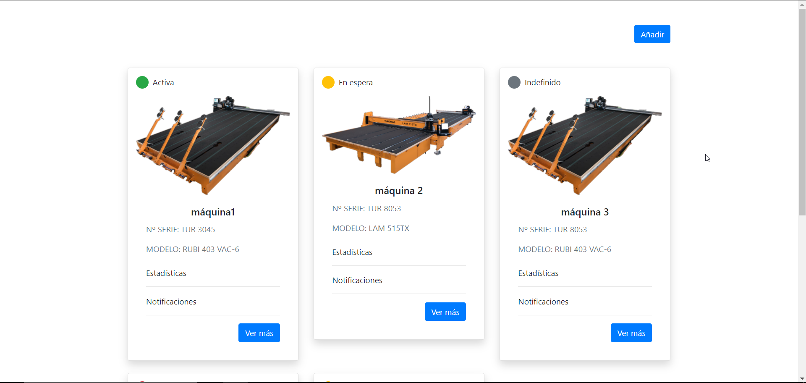

- :white_check_mark: v0.2.0 -> Uso de Angular Material como proveedor de componentes estándar y creación de un sidenav básico

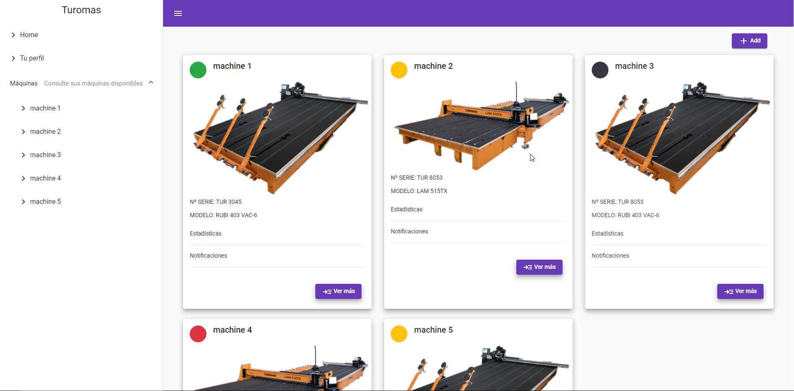

- :white_check_mark: v0.3.0 -> Página de registro básica

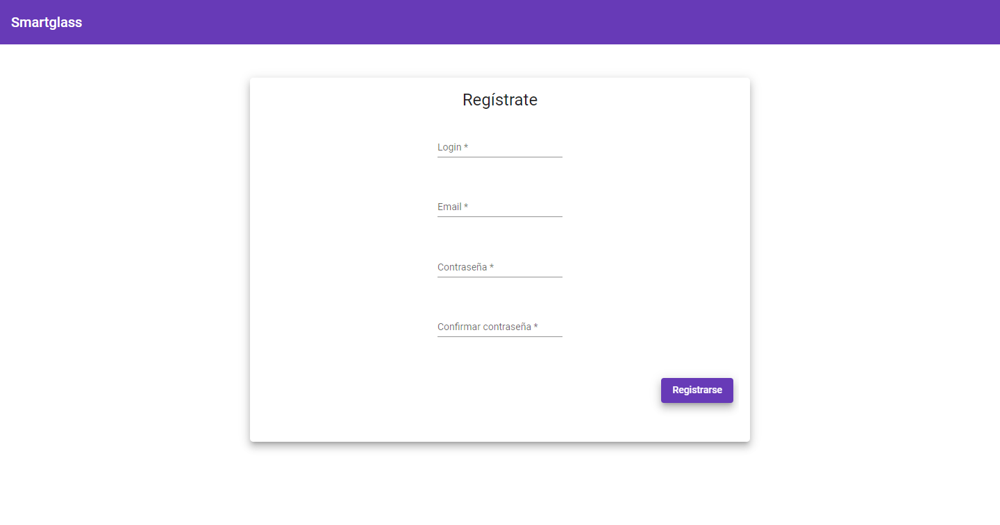

- :white_check_mark: v0.4.0 -> Página de login básica

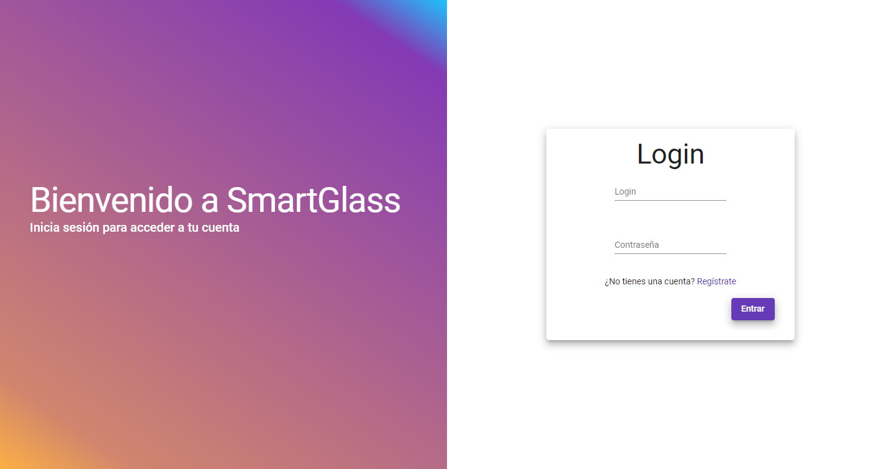

- :white_check_mark: v0.5.0 -> Lógica de negocio de autenticación con Google Firebase

- :white_check_mark: v0.6.0 -> Servicio de conexión con el backend y ratios de cada gemelo

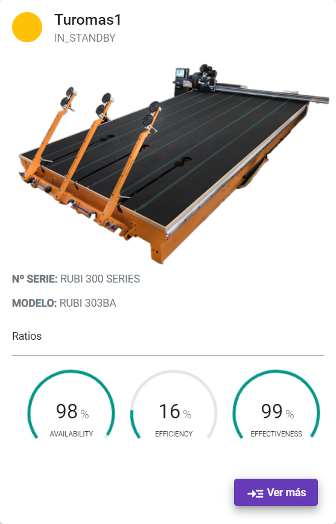

- :white_check_mark: v0.7.0 -> Primera versión que consigue mostrar gráficos y/o tablas de distintas estadísticas

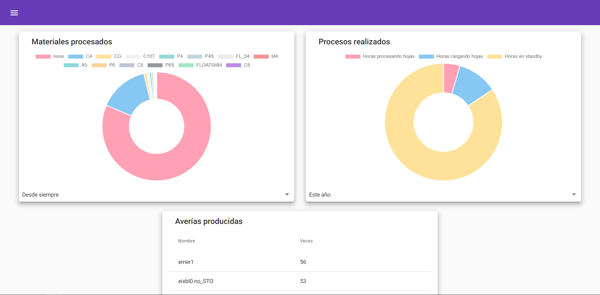

- :white_check_mark: v0.7.1 -> Carga dinámica de estadísticas, refactorización, loaders y mensajes de error

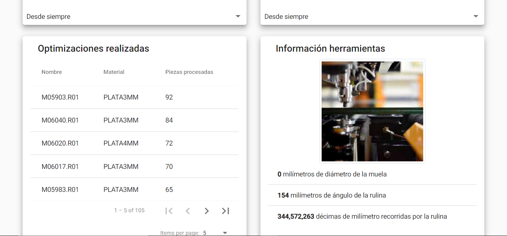

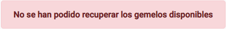

- :white_check_mark: v0.8.0 -> Añadido gráfico de líneas para mostrar el uso de la máquina

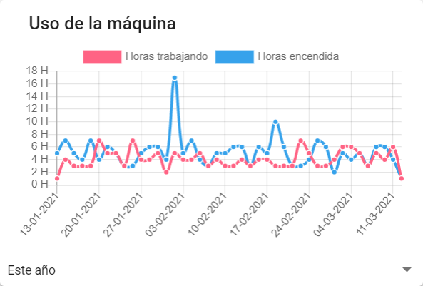

- :white_check_mark: v0.9.0 -> Interfaz internacionalizada y localizada al inglés y al español

- :white_check_mark: v0.9.1 -> Loader global con interceptors y pulido general

- :white_check_mark: v0.10.0 -> Perfil de usuario

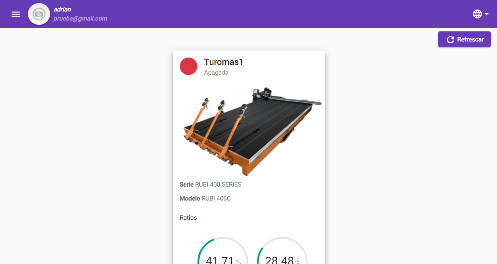
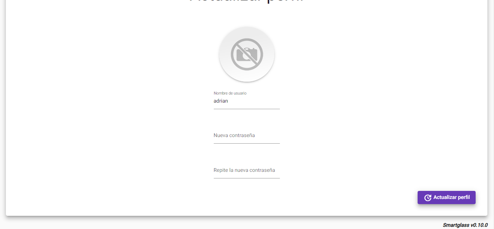

## 📁 Variables de entorno

Se deben usar estas variables en los ficheros environment.ts:
- production: boolean -> Indica si es una build de producción
- firebase: object -> Configuración de firebase
- twinsBaseURL: string -> URL base de la API de gemelos del backend
- statisticsBaseURL: string -> URL base de la API de estadísticas del backend

## 🏁 Integración continua

- Se dispone de un workflow de GitHub Actions que permite subir una imagen de la aplicación a Docker Hub en cada PUSH o PULL_REQUEST en la rama main

- 📋 Makefile:
	- Ejecutar `make build && make apache2-up-remote` para desplegar la aplicación en la máquina 155.210.68.101
	- Ejecutar `make docker-up-remote` para crear un contenedor en la máquina 155.210.68.101 con la última imagen disponible
		en Docker Hub
	- Ejecutar `make docker-down-remote` para parar dicho contenedor
	- Ejecutar `make logs` para obtener los logs del contenedor en el fichero `logs.txt`
	
	- NOTA: Se necesita tener un usuario en la máquina 155 o modificar el servidor de producción.
