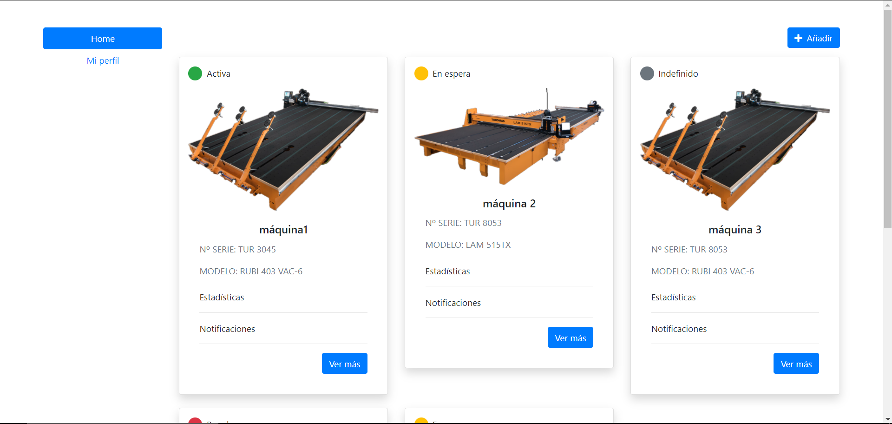
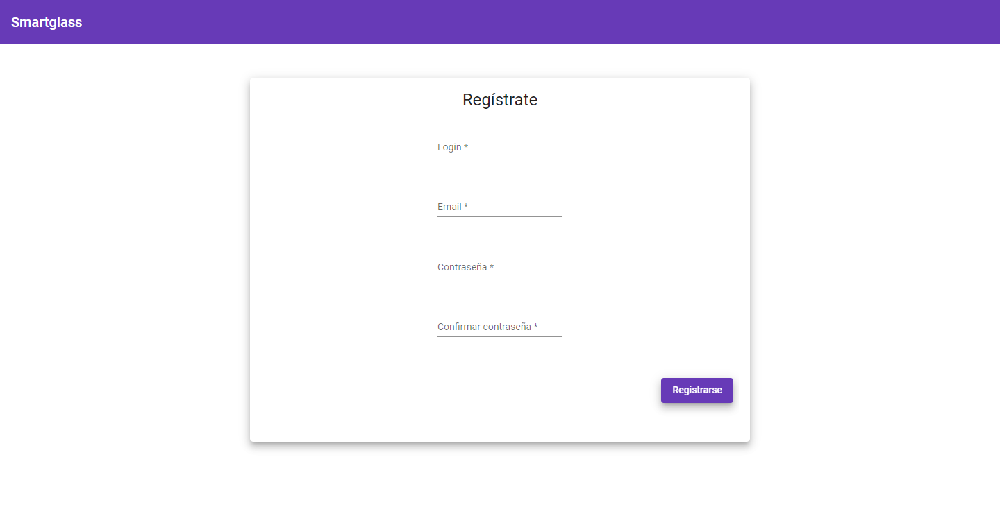
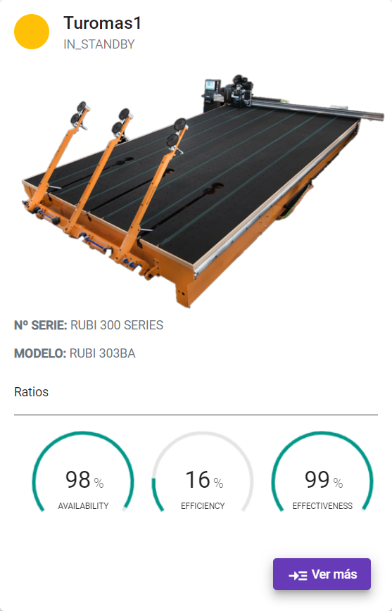
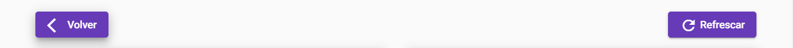
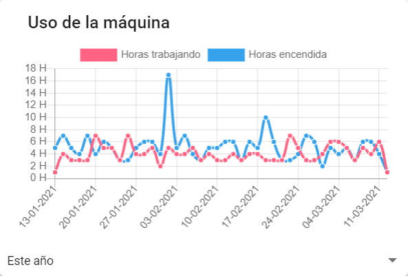
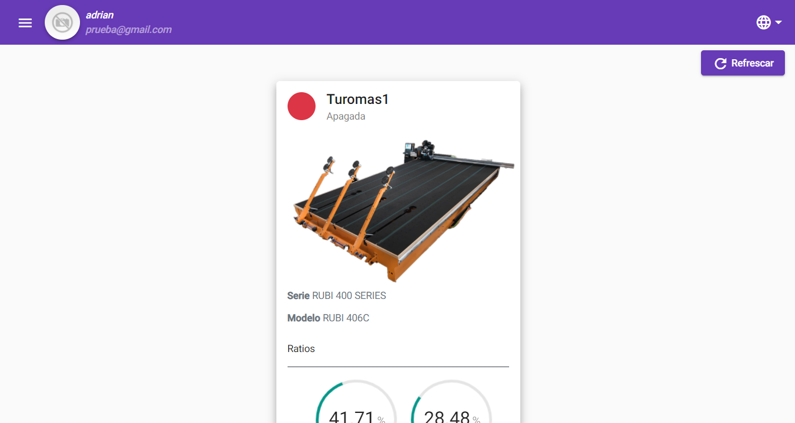
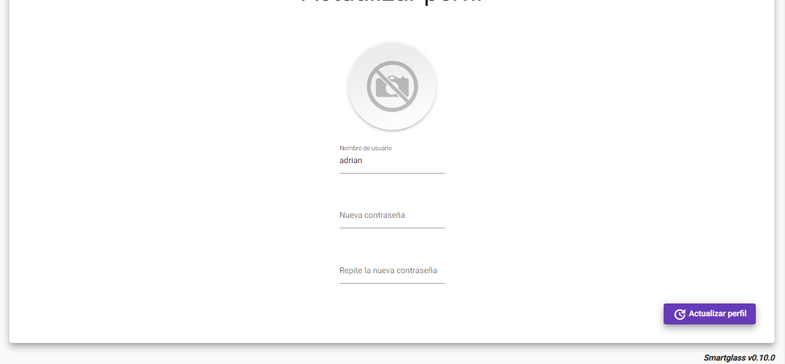

#  Smartglass Frontend


## 癸Introducci贸n

Smartglass es un software que permite a sus usuarios el mantenimiento predictivo de sus m谩quinas-herramienta de mecanizado de vidrio a tav茅s de diferentes anal铆ticas referentes a su funcionamiento productivo.

Este proyecto es el resultado de la implementaci贸n de la [metodolog铆a propuesta por dos investigadores de la Universidad de Auckland](https://doi.org/10.1016/j.jmsy.2018.05.003) para la implementaci贸n pr谩ctica de digital twins en el contexto de la Industria 4.0.

Forma parte de la realizaci贸n de mi TFG para la Universidad de Zaragoza.

##  Estado
```diff
+ [En desarrollo]
```

## ?Versiones disponibles
- :white_check_mark: v0.1.0 -> Se muestra un dashboard con los distintas gemelos de prueba



- :white_check_mark: v0.2.0 -> Uso de Angular Material como proveedor de componentes est谩ndar y creaci贸n de un sidenav b谩sico


- :white_check_mark: v0.3.0 -> P谩gina de registro b谩sica



- :white_check_mark: v0.4.0 -> P谩gina de login b谩sica


- :white_check_mark: v0.5.0 -> L贸gica de negocio de autenticaci贸n con Google Firebase

- :white_check_mark: v0.6.0 -> Servicio de conexi贸n con el backend y ratios de cada gemelo



- :white_check_mark: v0.7.0 -> Primera versi贸n que consigue mostrar gr谩ficos y/o tablas de distintas estad铆sticas


- :white_check_mark: v0.7.1 -> Carga din谩mica de estad铆sticas, refactorizaci贸n, loaders y mensajes de error





- :white_check_mark: v0.8.0 -> A帽adido gr谩fico de l铆neas para mostrar el uso de la m谩quina



- :white_check_mark: v0.9.0 -> Interfaz internacionalizada y localizada al ingl茅s y al espa帽ol

- :white_check_mark: v0.9.1 -> Loader global con interceptors y pulido general

- :white_check_mark: v0.10.0 -> Perfil de usuario




##  Variables de entorno

Se deben usar estas variables en los ficheros environment.ts:
- production: boolean -> Indica si es una build de producci贸n
- firebase: object -> Configuraci贸n de firebase
- twinsBaseURL: string -> URL base de la API de gemelos del backend
- statisticsBaseURL: string -> URL base de la API de estad铆sticas del backend

##  Integraci贸n continua

- Se dispone de un workflow de GitHub Actions que permite subir una imagen de la aplicaci贸n a Docker Hub en cada PUSH o PULL_REQUEST en la rama main

-  Makefile:
	- Ejecutar `make build && make apache2-up-remote` para desplegar la aplicaci贸n en la m谩quina 155.210.68.101
	- Ejecutar `make docker-up-remote` para crear un contenedor en la m谩quina 155.210.68.101 con la 煤ltima imagen disponible
		en Docker Hub
	- Ejecutar `make docker-down-remote` para parar dicho contenedor
	- Ejecutar `make logs` para obtener los logs del contenedor en el fichero `logs.txt`
	
	- NOTA: Se necesita tener un usuario en la m谩quina 155 o modificar el servidor de producci贸n.
